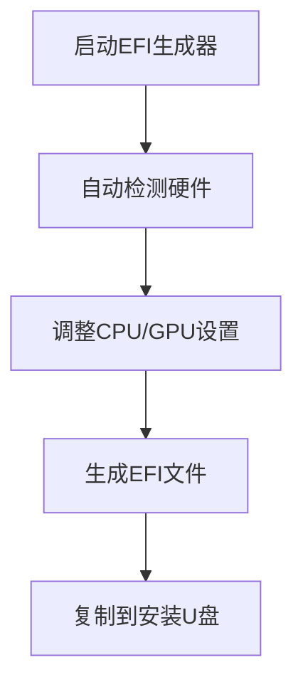

## 🚀 项目简介

**H Pro** 是一款专为黑苹果（Hackintosh）爱好者设计的全能工具箱软件。它将复杂的黑苹果安装过程简化为几个简单步骤，无论是新手还是资深玩家，都能轻松驾驭黑苹果的世界！

✨ **核心优势**：
- 自动化硬件检测与配置
- 可视化操作界面
- 智能驱动管理
- 一站式安装流程
- 持续更新维护

## 🔍 功能亮点

### 🛠️ 核心工具
| 功能 | 描述 | 图标 |
|------|------|------|
| **一键生成EFI** | 自动创建定制化引导文件 | <div style="font-size:24px">⚙️</div> |
| **macOS安装器** | 全自动安装黑苹果系统 | <div style="font-size:24px">🍎</div> |
| **驱动管理** | 智能下载/安装/更新驱动 | <div style="font-size:24px">🔌</div> |
| **磁盘工具** | 将DMG镜像写入U盘 | <div style="font-size:24px">💾</div> |

### 📊 系统工具
| 功能 | 描述 | 图标 |
|------|------|------|
| **EFI分区管理** | 浏览/编辑/备份EFI分区 | <div style="font-size:24px">📂</div> |
| **硬件检测** | 全面识别系统配置 | <div style="font-size:24px">🔍</div> |
| **网络诊断** | 解决网络连接问题 | <div style="font-size:24px">🌐</div> |
| **BIOS信息** | 查看BIOS设置和版本 | <div style="font-size:24px">💻</div> |

### 🎨 个性化
| 功能 | 描述 | 图标 |
|------|------|------|
| **主题系统** | 自定义软件外观 | <div style="font-size:24px">🎨</div> |
| **多语言支持** | 中英文界面切换 | <div style="font-size:24px">🌍</div> |
| **插件扩展** | 增强软件功能 | <div style="font-size:24px">🧩</div> |

## 📦 安装指南

### 系统要求
- **操作系统**：Windows 10/11 (64位)
- **Python版本**：3.8+
- **内存**：4GB+
- **磁盘空间**：100MB+

### 安装步骤

```bash
# 1. 克隆仓库
git clone https://github.com/Qicc/H Pro.git

# 2. 进入项目目录
cd H Pro

# 3. 安装依赖
pip install -r requirements.txt

# 4. 运行程序
python main.py
```

### 快速启动
对于不想安装Python环境的用户，我们提供[预编译版本](https://github.com/Qicc/XTools/releases)下载

## 🧭 使用指南

### 生成EFI文件


### 安装macOS


## 🧩 功能预览

<div align="center">
  <table>
    <tr>
      <td align="center">
        
        <p><strong>系统仪表盘</strong></p>
      </td>
      <td align="center">
        
        <p><strong>EFI生成器</strong></p>
      </td>
      <td align="center">
        
        <p><strong>macOS安装器</strong></p>
      </td>
    </tr>
  </table>
</div>

## 🤝 贡献指南

我们欢迎各种形式的贡献：
1. **提交问题报告** - 遇到问题？[提交Issue](https://github.com/Qicc097/HPro/issues)
2. **提出新功能** - 有好的想法？[分享建议](https://github.com/Qicc097/HPro/discussions)
3. **代码贡献** - 开发人员？提交Pull Request
4. **文档完善** - 帮助改进文档
5. **翻译支持** - 添加更多语言

**贡献前请阅读** [贡献指南](CONTRIBUTING.md)

## 📜 许可证

H Pro 采用 **GPL-3.0 许可证** 开源发布。详情请查看 [LICENSE](LICENSE) 文件。## 🚀 项目简介

**H Pro** 是一款专为黑苹果（Hackintosh）爱好者设计的全能工具箱软件。它将复杂的黑苹果安装过程简化为几个简单步骤，无论是新手还是资深玩家，都能轻松驾驭黑苹果的世界！

✨ **核心优势**：
- 自动化硬件检测与配置
- 可视化操作界面
- 智能驱动管理
- 一站式安装流程
- 持续更新维护

## 🔍 功能亮点

### 🛠️ 核心工具
| 功能 | 描述 | 图标 |
|------|------|------|
| **一键生成EFI** | 自动创建定制化引导文件 | <div style="font-size:24px">⚙️</div> |
| **macOS安装器** | 全自动安装黑苹果系统 | <div style="font-size:24px">🍎</div> |
| **驱动管理** | 智能下载/安装/更新驱动 | <div style="font-size:24px">🔌</div> |
| **磁盘工具** | 将DMG镜像写入U盘 | <div style="font-size:24px">💾</div> |

### 📊 系统工具
| 功能 | 描述 | 图标 |
|------|------|------|
| **EFI分区管理** | 浏览/编辑/备份EFI分区 | <div style="font-size:24px">📂</div> |
| **硬件检测** | 全面识别系统配置 | <div style="font-size:24px">🔍</div> |
| **网络诊断** | 解决网络连接问题 | <div style="font-size:24px">🌐</div> |
| **BIOS信息** | 查看BIOS设置和版本 | <div style="font-size:24px">💻</div> |

### 🎨 个性化
| 功能 | 描述 | 图标 |
|------|------|------|
| **主题系统** | 自定义软件外观 | <div style="font-size:24px">🎨</div> |
| **多语言支持** | 中英文界面切换 | <div style="font-size:24px">🌍</div> |
| **插件扩展** | 增强软件功能 | <div style="font-size:24px">🧩</div> |

## 📦 安装指南

### 系统要求
- **操作系统**：Windows 10/11 (64位)
- **Python版本**：3.8+
- **内存**：4GB+
- **磁盘空间**：100MB+

### 安装步骤

```bash
# 1. 克隆仓库
git clone https://github.com/Qicc/HPro.git

# 2. 进入项目目录
cd H Pro

# 3. 安装依赖
pip install -r requirements.txt

# 4. 运行程序
python main.py
```

### 快速启动
对于不想安装Python环境的用户，我们提供[预编译版本](https://github.com/Qicc/XTools/releases)下载

## 🧭 使用指南

### 生成EFI文件


### 安装macOS


## 🧩 功能预览

<div align="center">
  <table>
    <tr>
      <td align="center">
        
        <p><strong>系统仪表盘</strong></p>
      </td>
      <td align="center">
        
        <p><strong>EFI生成器</strong></p>
      </td>
      <td align="center">
        
        <p><strong>macOS安装器</strong></p>
      </td>
    </tr>
  </table>
</div>

## 🤝 贡献指南

我们欢迎各种形式的贡献：
1. **提交问题报告** - 遇到问题？[提交Issue](https://github.com/Qicc/HPro/issues)
2. **提出新功能** - 有好的想法？[分享建议](https://github.com/Qicc/HPro/discussions)
3. **代码贡献** - 开发人员？提交Pull Request
4. **文档完善** - 帮助改进文档
5. **翻译支持** - 添加更多语言

**贡献前请阅读** [贡献指南](CONTRIBUTING.md)

## 📜 许可证

XTools 采用 **GPL-3.0 许可证** 开源发布。详情请查看 [LICENSE](LICENSE) 文件。
